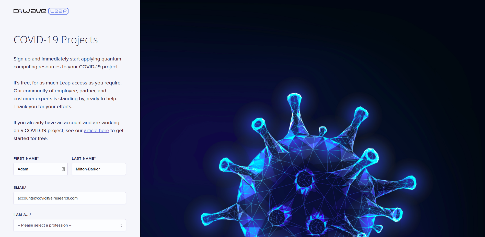

# Peter Moss COVID-19 AI Research Project

## COVID-19 AI Quantum DWave Leap

 

# Introduction
The COVID-19 AI Quantum DWave Leap repository is an Artificial Intelligence & Quantum processing research and development project using D-Wave Systems Leap. AI algorithm training & running on DWave Leap, aimed at fighting, and understanding COVID-19.

&nbsp;

# D-Wave Systems Leap

Apply quantum computing resources to your COVID-19 project. It's free, for as much Leap access as you require. D-Wave Systems' community of employee, partner, and customer experts is standing by, ready to help. " [Source](https://cloud.dwavesys.com/leap/signup/covid19/ "Source")

&nbsp;

# The COVID-19 AI Quantum DWave Leap 0.1.0

You can keep up to date with the latest code on the current dev branch, 0.1.0. The current version and dev branch are always noted at the top of the README in the project root of all of our repositories.

&nbsp;

## 0.1.0 Installation
Please follow the [Installation Guide](Documentation/Installation/Installation.md "Installation Guide") to install COVID-19 AI Quantum DWave Leap 0.1.0.

&nbsp;

# Contributing

The Peter Moss Acute Myeloid & Lymphoblastic Leukemia AI Research project encourages and welcomes code contributions, bug fixes and enhancements from the Github.

Please read the [CONTRIBUTING](https://github.com/COVID-19-AI-Research-Project/COVID19-AI-Quantum-DWave-Leap/blob/master/CONTRIBUTING.md "CONTRIBUTING") document for a full guide to forking our repositories and submitting your pull requests. You will also find information about our code of conduct on this page.

## Contributors

- **AUTHOR:** [Adam Milton-Barker](https://www.leukemiaresearchassociation.ai/team/adam-milton-barker "Adam Milton-Barker") - [Peter Moss Leukemia AI Research](https://www.leukemiaresearchassociation.ai "Peter Moss Leukemia AI Research") Founder & Intel Software Innovator, Sabadell, Spain

&nbsp;

# Versioning

We use SemVer for versioning. For the versions available, see [Releases](https://github.com/COVID-19-AI-Research-Project/COVID19-AI-Quantum-DWave-Leap/releases "Releases").

&nbsp;

# License

This project is licensed under the **MIT License** - see the [LICENSE](https://github.com/COVID-19-AI-Research-Project/COVID19-AI-Quantum-DWave-Leap/blob/master/LICENSE "LICENSE") file for details.

&nbsp;

# Bugs/Issues

We use the [repo issues](https://github.com/COVID19-Medical-Support-System-Server/issues "repo issues") to track bugs and general requests related to using this project. See [CONTRIBUTING](https://github.com/COVID19-Medical-Support-System-Server/blob/master/CONTRIBUTING.md "CONTRIBUTING") for more info on how to submit bugs, feature requests and proposals.